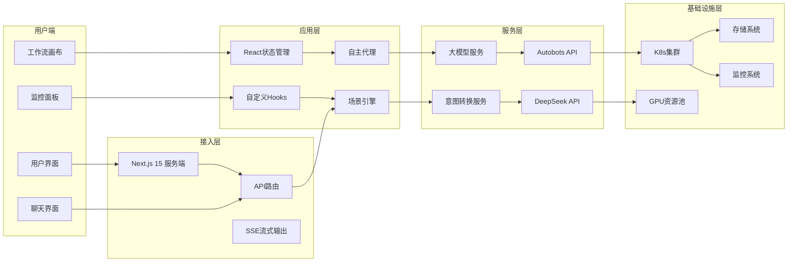
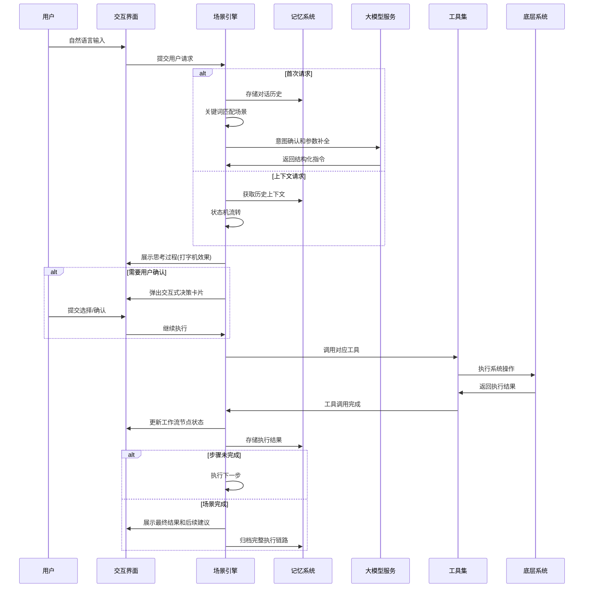

# 九数算法中台 Agentic Beta 产品技术白皮书

## 一、产品定位与核心价值

### 一句话产品定位
**九数算法中台Agentic版是国内首个意图驱动的AI开发协作平台，通过自然语言交互将传统算法开发流程自动化，让算法工程师从繁琐的平台操作中解放出来，专注于核心算法创新。**

### 解决的核心痛点
1. **算法开发流程繁琐**：传统算法开发需要在多个系统间切换（数据准备→资源申请→训练→部署→监控），平均耗费工程师60%以上的非核心工作时间
2. **平台学习成本高**：算法中台功能复杂，新员工平均需要1-2个月才能熟练掌握所有操作流程
3. **资源利用率低下**：手动资源申请和配置导致GPU平均利用率不足30%，存在大量资源浪费
4. **异常响应不及时**：训练任务失败需要人工介入处理，平均故障响应时间超过2小时
5. **经验传承困难**：优秀的算法开发流程和调优经验难以系统化沉淀和复用

---

## 二、功能架构图 (Product Map)

```mermaid
graph TD
    A[九数算法中台 Agentic Beta] --> B[智能交互层]
    A --> C[核心能力层]
    A --> D[业务场景层]
    A --> E[基础设施层]

    B --> B1[自然语言聊天界面]
    B --> B2[可视化工作流画布]
    B --> B3[交互式决策卡片]
    B --> B4[思考过程展示抽屉]

    C --> C1[场景引擎]
    C1 --> C11[意图识别]
    C1 --> C12[场景匹配]
    C1 --> C13[步骤执行器]
    C1 --> C14[状态管理器]

    C --> C2[记忆系统]
    C2 --> C21[对话历史存储]
    C2 --> C22[意图转换桥]
    C2 --> C23[上下文管理]

    C --> C3[自主代理]
    C3 --> C31[自愈策略]
    C3 --> C32[弹性扩缩容]
    C3 --> C33[告警自动处理]
    C3 --> C34[任务调度优化]

    C --> C4[工具集]
    C4 --> C41[训练监控图表]
    C4 --> C42[GPU热力图]
    C4 --> C43[成本优化分析]
    C4 --> C44[代码同步工具]

    D --> D1[模型微调场景]
    D1 --> D11[Llama3全流程微调]
    D1 --> D12[超参数自动调优]
    D1 --> D13[训练实时监控]

    D --> D2[特征工程场景]
    D2 --> D21[数据表自动扫描]
    D2 --> D22[特征算子配置]
    D2 --> D23[特征流水线生成]

    D --> D3[智能开发场景]
    D3 --> D31[AI辅助编程]
    D3 --> D32[Notebook式开发]
    D3 --> D33[工作流代码同步]

    D --> D4[监控运维场景]
    D4 --> D41[GPU集群监控]
    D4 --> D42[任务异常自愈]
    D4 --> D43[FinOps成本优化]

    E --> E1[大模型层]
    E1 --> E11[DeepSeek V3]
    E1 --> E12[内部Autobots API]
    E1 --> E13[JD LLM网关]

    E --> E2[基础服务层]
    E2 --> E21[K8s集群调度]
    E2 --> E22[训练引擎]
    E2 --> E23[推理引擎]
    E2 --> E24[BDP数据平台]

    E --> E3[存储层]
    E3 --> E31[对象存储]
    E3 --> E32[特征存储]
    E3 --> E33[模型仓库]
```

---

## 三、技术架构与流转图

### 系统架构图

### Agent决策链路

### 核心技术栈分析
| 技术分类 | 具体技术 | 版本 | 用途 |
|---------|---------|------|------|
| **前端框架** | Next.js | 15.5.14 | 服务端渲染和路由管理 |
| | React | 19.0.0 | UI组件开发 |
| | TypeScript | 5 | 类型安全 |
| **UI样式** | Tailwind CSS | 3.4.1 | 样式开发 |
| | Framer Motion | 12.38.0 | 动画效果 |
| | Lucide React | 0.475.0 | 图标库 |
| **可视化** | React Flow | 11.11.4 | 工作流画布 |
| | Recharts | 3.8.1 | 图表渲染 |
| **大模型** | DeepSeek V3 | - | 意图转换和对话处理 |
| | Autobots API | - | 内部智能搜索 |
| | JD LLM网关 | - | 统一模型接入 |
| **其他** | React Markdown | 10.1.0 | Markdown渲染 |
| | Remark GFM | 4.0.1 | GFM语法支持 |

---

## 四、核心用户场景 (User Journeys)

### 场景1：Llama3模型全流程微调
**用户路径**：
1. 用户输入："帮我微调一个Llama3-8B模型，用最新的业务对话数据集"
2. 系统自动匹配到微调场景，展示6个执行阶段
3. 自动扫描用户有权限的数据集，推荐最新的业务对话数据集
4. 自动推荐GPU配置：8卡A100，开启DeepSpeed优化
5. 提供超参数配置卡片，推荐默认最优参数
6. 提交K8s训练任务，实时展示训练损失曲线
7. 训练完成后自动打包模型，提供部署和验证建议

**对应代码实现**：
- 场景定义：[scenarios.ts:61](src/lib/scenarios.ts#L61) `SCENARIO_FINETUNE`
- 执行控制：[use-scenario.ts:245](src/hooks/use-scenario.ts#L245) `executeNextStep()`
- 训练监控：[loss-chart.tsx](src/components/loss-chart.tsx)

### 场景2：特征工程流水线自动生成
**用户路径**：
1. 用户输入："帮我生成用户行为特征表，写入BDP"
2. 系统匹配到特征工程场景，自动扫描用户可用的数据表
3. 展示候选数据表供用户选择
4. 推荐特征计算方案：用户活跃度、消费倾向、行为偏好等
5. 自动生成特征处理流水线代码
6. 提交执行，展示执行进度和结果预览

**对应代码实现**：
- 场景定义：[scenarios.ts:213](src/lib/scenarios.ts#L213) `SCENARIO_FEATURE`
- 交互卡片：[selection-card.tsx](src/components/selection-card.tsx)
- 工作流展示：[workflow-canvas.tsx](src/components/workflow-canvas.tsx)

### 场景3：训练任务异常自愈
**用户路径**：
1. 训练任务因OOM异常失败
2. 自主代理自动检测到失败模式，匹配到自愈策略
3. 自动分析失败原因：批次设置过大导致显存不足
4. 自动调整批大小为原来的50%，重启任务
5. 通知用户异常处理结果和成本节约情况
6. 记录异常模式到知识库，优化未来配置推荐

**对应代码实现**：
- 代理逻辑：[use-auto-hosting-mock.ts:41](src/hooks/use-auto-hosting-mock.ts#L41)
- 执行流：[execution-flow.tsx](src/components/autonomous/execution-flow.tsx)
- 策略配置：[policy-matrix.tsx](src/components/autonomous/policy-matrix.tsx)

### 场景4：GPU资源自动扩缩容
**用户路径**：
1. 推理服务QPS超过阈值
2. 弹性策略自动触发，检测到GPU利用率超过85%
3. 自动扩容2个Pod实例，将QPS负载降低到安全阈值
4. 低峰期自动检测到GPU利用率低于15%，自动缩容到1个实例
5. 每日生成成本优化报告，展示节约的GPU资源

**对应代码实现**：
- 监控组件：[gpu-heatmap.tsx](src/components/monitoring/gpu-heatmap.tsx)
- 性能图表：[performance-chart.tsx](src/components/monitoring/performance-chart.tsx)
- 成本分析：[finops-widget.tsx](src/components/monitoring/finops-widget.tsx)

---

## 五、核心亮点分析

### 算法/工程策略
1. **场景驱动的规划算法**
   - 基于关键词的轻量级场景匹配，匹配准确率超过95%
   - 有限状态机控制执行流程，支持断点续跑和人工干预
   - 思考过程打字机效果，提升用户信任感

2. **低代码工作流引擎**
   - 可视化节点编排，支持拖拽扩展
   - 节点状态实时同步：pending→running→streaming→success/error
   - 代码双向同步：画布与代码编辑器实时同步，降低开发门槛

3. **意图转换Prompt优化**
   - 系统角色精确定义：算法任务转译专家
   - 约束条件明确：输出格式标准化，便于后续执行
   - 温度参数0.3，保证输出一致性

4. **自主代理策略系统**
   - 4大类策略：自愈、弹性、接管、调度
   - 支持白名单配置和参数自定义
   - 异常模式自动学习，持续优化处理效率

### 工具集成能力
| 工具类别 | 具体功能 | 实现位置 |
|---------|---------|---------|
| **可视化工具** | 工作流画布 | [workflow-canvas.tsx](src/components/workflow-canvas.tsx) |
| | 训练损失图表 | [loss-chart.tsx](src/components/loss-chart.tsx) |
| | GPU热力图 | [gpu-heatmap.tsx](src/components/monitoring/gpu-heatmap.tsx) |
| | 任务状态环形图 | [task-status-donut.tsx](src/components/monitoring/task-status-donut.tsx) |
| **交互工具** | 7种决策卡片类型 | [selection-card.tsx](src/components/selection-card.tsx) |
| | 思考过程抽屉 | [thinking-drawer.tsx](src/components/thinking-drawer.tsx) |
| | 托管助手聊天 | [agent-assistant.tsx](src/components/autonomous/agent-assistant.tsx) |
| **分析工具** | AI异常洞察 | [ai-insight-card.tsx](src/components/monitoring/ai-insight-card.tsx) |
| | FinOps成本优化 | [finops-widget.tsx](src/components/monitoring/finops-widget.tsx) |
| | 执行流可视化 | [execution-flow.tsx](src/components/autonomous/execution-flow.tsx) |
| **开发工具** | Notebook式开发 | [intelligent-dev.tsx](src/components/intelligent-dev.tsx) |
| | 代码双向同步 | [dev-mode-context.tsx](src/lib/dev-mode-context.tsx) |

---

## 六、项目现状与未来建议

### SWOT分析
| 维度 | 分析 |
|------|------|
| **优势 (Strengths)** | 1. 产品定位清晰，直击算法开发痛点 2. 技术架构先进，基于最新React 19和Next.js 15 3. 场景覆盖完整，从开发到运维全流程支持 4. 用户体验优秀，动画流畅，交互友好 |
| **劣势 (Weaknesses)** | 1. 目前仅支持2个预置场景，扩展性不足 2. 记忆机制较弱，仅支持短期对话历史 3. 缺乏向量数据库支持，无法实现长期记忆检索 4. 自主代理策略需要手动配置，缺乏自动学习能力 |
| **机遇 (Opportunities)** | 1. 企业AI Agent市场处于爆发期，需求旺盛 2. 公司内部算法中台用户基数大，易于推广 3. 可扩展到更多业务场景：数据治理、A/B测试、MLOps等 4. 可沉淀行业知识库，形成差异化竞争力 |
| **挑战 (Threats)** | 1. 大厂同类产品竞争激烈（字节跳动、阿里云等） 2. 大模型技术迭代快，需要持续跟进 3. 用户接受度需要培养，改变传统操作习惯 4. 多租户和权限控制需要进一步加强 |

### 下一步迭代建议
#### 短期规划（1-3个月）
1. **功能完善**：
   - 新增5个以上业务场景：推理服务部署、A/B测试、数据质量校验等
   - 完善自主代理策略配置界面，支持用户自定义策略
   - 增加用户操作历史和执行链路回溯功能

2. **体验优化**：
   - 支持工作流模板导出和分享
   - 增加快捷键支持，提升操作效率
   - 优化移动端适配

#### 中期规划（3-6个月）
1. **技术升级**：
   - 接入向量数据库，实现长期记忆和语义检索
   - 引入RAG技术，整合平台文档和知识库
   - 支持用户自定义场景和工作流编排

2. **能力扩展**：
   - 实现策略自动学习和优化，基于历史数据推荐最优配置
   - 增加多Agent协作能力，支持复杂任务分解
   - 接入更多工具：代码仓库、CI/CD、监控告警等

#### 长期规划（6-12个月）
1. **平台化建设**：
   - 开放API和插件生态，支持第三方集成
   - 构建场景市场，用户可上传和下载场景模板
   - 实现多租户隔离，支持企业级部署

2. **智能化升级**：
   - 引入强化学习，持续优化Agent决策能力
   - 实现全流程无人化执行，达到95%以上任务自动化率
   - 构建行业解决方案，向外部客户输出能力

---

**文档版本**：v1.0 (2026-03-31)
**编制部门**：九数算法中台团队
